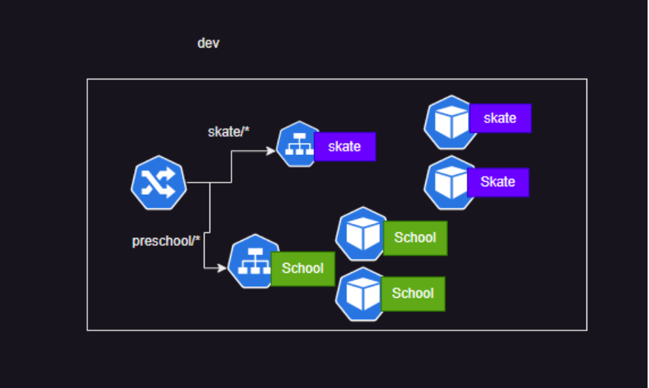
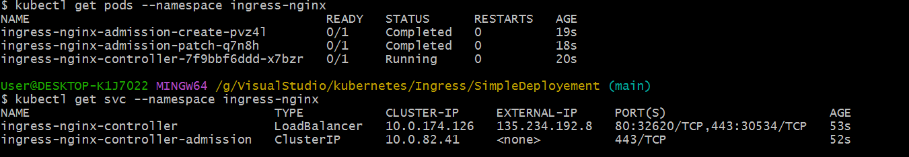
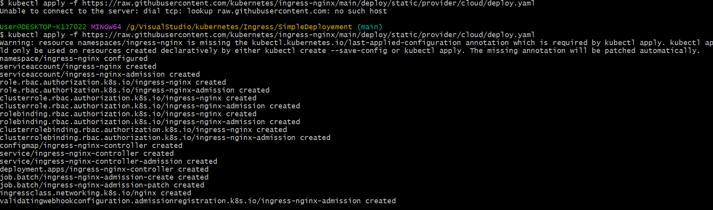
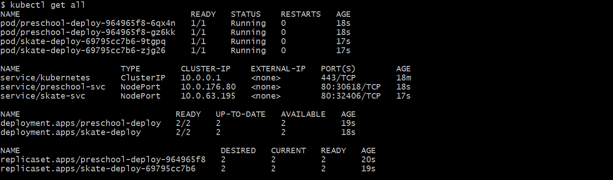
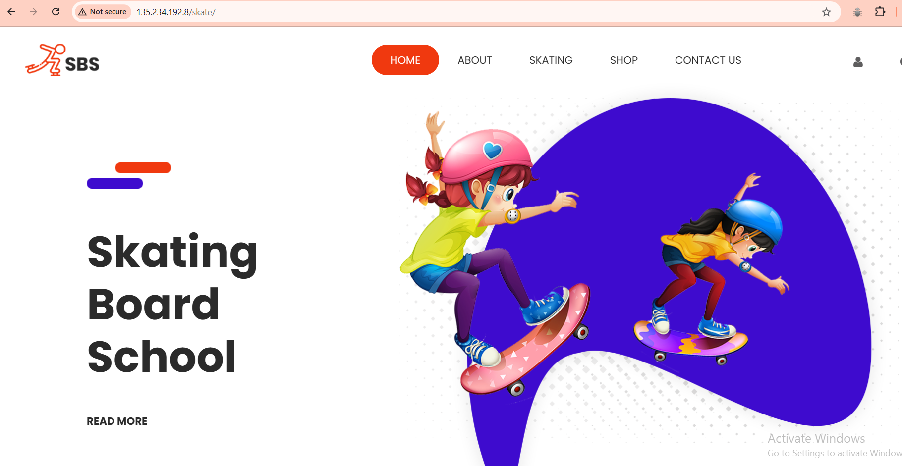

# Run an website inside a pod Using Ingress rules and HPA

1. Ensure you have installed k8s cluster on your system.
2. Download the website from [html
website](https://www.free-css.com/free-css-templates)
3. Lets look at our apps
    - prachiii123/preschool
    - This runs a preshool  app on path /preschool  on    port 80
   - prachiii123/skate
    - This runs a skate board app on path /skate on port 80 
4. Lets write an simple deployment file for above applications.
  [Preschool](Preschool.yaml)
  [Skate](Skate.yaml)

5. Now lets write an ingress rules for above files
 - K8s doesnot have a default ingress implementation, for this exercise lets use nginx ingress controller
 ```
 kubectl apply -f https://raw.githubusercontent.com/kubernetes/ingress-nginx/main/deploy/static/provider/cloud/deploy.yaml
```
 - Now Lets write an Ingress rules [ReferHere](Ingress.yaml)

- If you have not installed nginx controller then you can install here
1. Create a Namespace
```bash
kubectl create namespace ingress-nginx
``` 

2. Apply the NGINX Ingress Controller Manifest:
```bash
kubectl apply -f https://raw.githubusercontent.com/kubernetes/ingress-nginx/main/deploy/static/provider/cloud/deploy.yaml
```
   

3. Verify the Deployment:
```bash
kubectl get pods --namespace ingress-nginx
```
  

4. Check the Service:
  - To see if the NGINX Ingress Controller has been assigned a public IP address, run:
  ```bash
  kubectl get svc --namespace ingress-nginx
  ```
 - Look for the service of type `LoadBalancer` and note its `EXTERNAL-IP`. It may take a few minutes for the IP to be assigned.
 
 5. Now Execute the following Commads
 ```
 kubectl apply -f Preschool.yaml
 kubeclt apply -f Skate.yaml
 ```

 6. lets check our appliaction is running or not
 ```
 kubectl get all
 ```
 

 7. To check website for Preschool
    put `/preschool` after `ip-addresss`
    `http://ip-address/preschool`
    - for Skate
    put `/skate` after `ip-addresss`
    `http://ip-address/skate`





